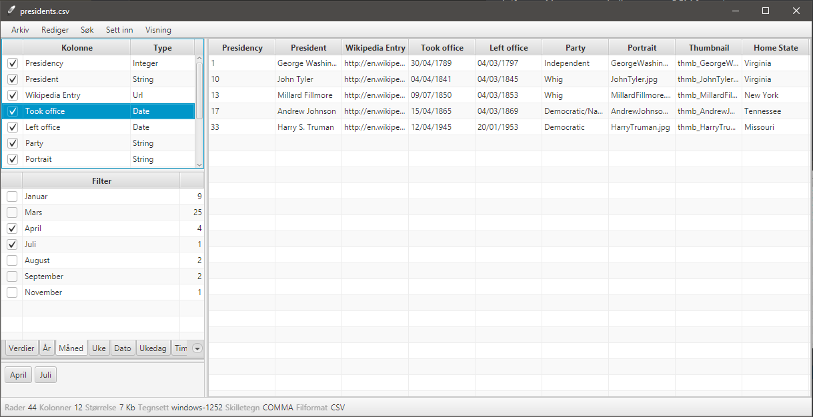

# CSV

This desktop application is able to read and display CSV files on multiple platforms.
You can read all common CSV formats:
- tab separated files
- comma separated files
- pipe separated files
- different encodings
- with our without quotes

# Screenshot

Shows the application on Windows 10

